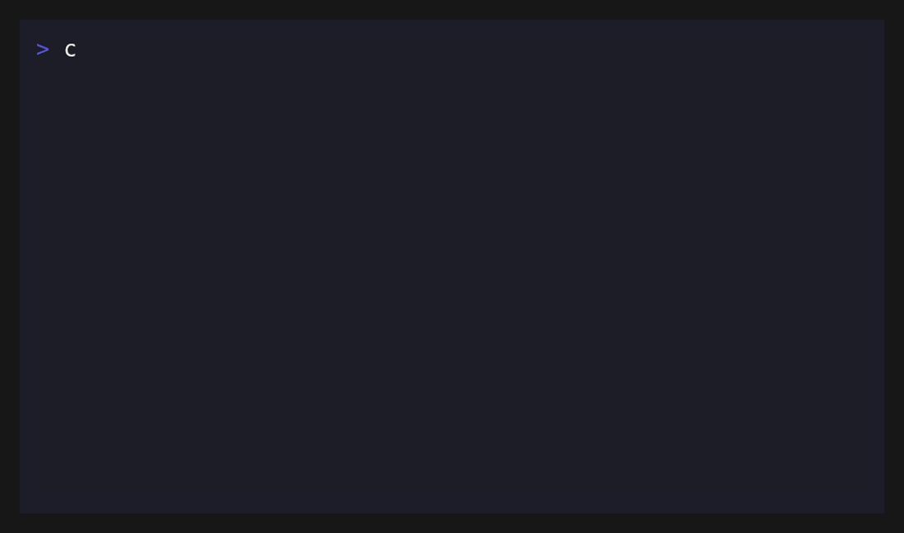

# neofetch-security-notes


Lightweight defensive tooling for reducing accidental metadata exposure in shared system outputs and repositories.

This project provides a small toolkit for sanitizing terminal output and scanning repository files for patterns that may reveal environment-specific or sensitive information before publication.

---

## Demo



Example workflow showing sanitization and optional disclosure scanning before sharing system output.

## What problem does this solve?

Developers frequently share terminal output, configuration notes, screenshots, or debugging information without realizing how much environment-specific metadata they expose.

Examples include:

- hostnames
- local filesystem paths
- internal IP addresses
- user identifiers
- environment fingerprints

This toolkit provides simple guardrails to reduce accidental disclosure before content is shared publicly.

---

# Quick Start

Generate sanitized system output before sharing:

```bash
neofetch | ./tools/sanitize-neofetch.sh --strict
```

Optionally scan the sanitized output for risky disclosure patterns:

```bash
neofetch | ./tools/sanitize-neofetch.sh --strict | ./tools/redflag-scan.sh
```

This helps reduce exposure of hostnames, paths, identifiers, and other environment-specific details.

---

# Toolkit Components

The repository includes several small defensive utilities.

### sanitize-neofetch

Sanitizes system output to remove or redact metadata that could reveal host or environment details.

```
tools/sanitize-neofetch.sh
```

Typical usage:

```bash
neofetch | ./tools/sanitize-neofetch.sh --strict
```

---

### redflag-scan

Scans files or streams for patterns that may indicate accidental disclosure.

```
tools/redflag-scan.sh
```

Example:

```bash
cat report.txt | ./tools/redflag-scan.sh
```

---

### safe-share

Pipeline helper combining sanitization and scanning.

```
tools/safe-share.sh
```

Example workflow:

```bash
neofetch | ./tools/safe-share.sh sanitize | ./tools/safe-share.sh scan
```

---

# Development Workflow

This project includes local and CI guardrails.

### Local checks

Run defensive checks locally before committing:

```bash
make check
```

### Install commit hooks

```bash
make hooks
```

The pre-commit hook scans staged changes for patterns that could expose sensitive information.

---

### Continuous Integration

GitHub Actions runs a repository scan using:

```
.github/workflows/redflag-scan.yml
```

This ensures repository files do not accidentally introduce risky patterns.

---

# Design Goals

The project focuses on lightweight defensive tooling.

Goals include:

- catch obvious disclosure patterns early
- keep tooling simple and transparent
- support local-first developer workflows
- reinforce checks in CI pipelines

---

# Security Philosophy

This project focuses on **preventing accidental disclosure**, not on replacing full security tooling.

It is intended as a lightweight layer of protection for developers sharing technical content publicly.

---

# Limitations

This toolkit does **not** replace:

- full secret scanning tools
- professional security review
- threat modeling
- credential management systems

Instead, it provides simple guardrails to reduce common mistakes when sharing system information.

---

# License

MIT License
