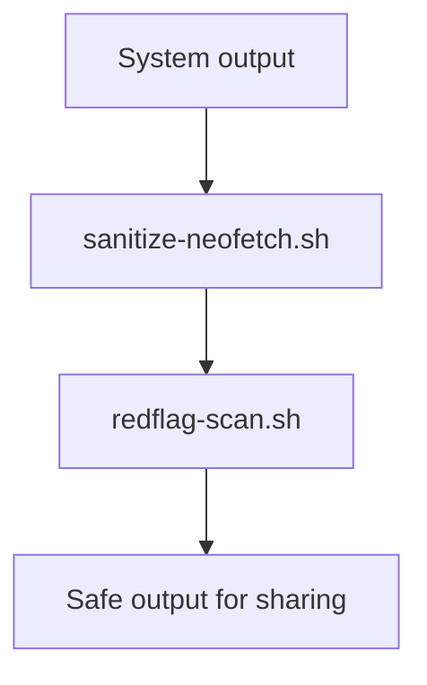

# neofetch-security-notes


Lightweight defensive tooling for reducing accidental metadata exposure when sharing system information.

Developers frequently post terminal output, debugging logs, or system information online without realizing how much metadata it reveals.  
This project provides simple guardrails to sanitize system output and detect potentially sensitive patterns before sharing.

---

## Demo


Example workflow showing sanitization and optional disclosure scanning before sharing system output.

---

## Workflow



---

## What problem does this solve?

Technical output can unintentionally expose environment details such as:

- hostnames  
- local filesystem paths  
- internal IP addresses  
- environment fingerprints  

Even small pieces of metadata can reveal useful information about a developer’s system or infrastructure.

This project helps prevent accidental disclosure by sanitizing system output and scanning it for risky patterns before sharing.

---

## Quick Start

Generate sanitized system output before sharing:

```bash
neofetch | ./tools/sanitize-neofetch.sh --strict
```

Optionally scan the sanitized output for disclosure patterns:

```bash
neofetch | ./tools/sanitize-neofetch.sh --strict | ./tools/redflag-scan.sh
```

---

## Toolkit Components

### sanitize-neofetch

Sanitizes system output by removing or replacing metadata that may reveal environment details.

```bash
tools/sanitize-neofetch.sh
```

Example:

```bash
neofetch | ./tools/sanitize-neofetch.sh --strict
```

---

### redflag-scan

Scans text input or repository files for patterns that may indicate accidental disclosure.

```bash
tools/redflag-scan.sh
```

Example:

```bash
cat output.txt | ./tools/redflag-scan.sh
```

---

### safe-share

Pipeline helper that combines sanitization and scanning.

```bash
tools/safe-share.sh
```

Example workflow:

```bash
neofetch | ./tools/safe-share.sh sanitize | ./tools/safe-share.sh scan
```

---

## Development Workflow

### Run local checks

```bash
make check
```

### Install commit hooks

```bash
make hooks
```

The pre-commit hook scans staged changes to prevent accidental disclosure before commits are created.

---

### Continuous Integration

The repository includes an automated security check via GitHub Actions:

```
.github/workflows/redflag-scan.yml
```

This workflow scans repository files to detect potential disclosure patterns.

---

## Security Philosophy

This project focuses on **preventing accidental disclosure**, not protecting stored secrets.

It is designed as a lightweight defensive layer for developers sharing system output publicly.

---

## Security Notes

See [docs/security-notes.md](docs/security-notes.md) for design decisions, scope, and trade-offs.

---

## License

MIT License
